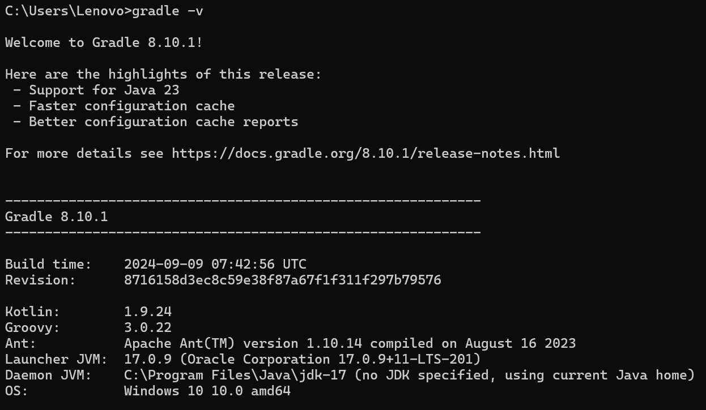

## Selenium

Es una herramienta de **automatización de pruebas** de código abierto diseñada para probar aplicaciones web. Permite a los testers y desarrolladores crear scripts para automatizar las interacciones de usuario en navegadores como Chrome, Firefox, Safari, y Edge, simulando acciones como clics, entrada de texto y navegación entre páginas.

### Componentes principales de Selenium

- **Selenium WebDriver**: Es una **librería** que permite escribir scripts en varios lenguajes de programación (como Java, Python, C#, y JavaScript) y controlar el navegador directamente. Es ideal para pruebas funcionales y de interfaz de usuario en aplicaciones web.
    
- **Selenium IDE**: Una **herramienta de grabación y reproducción** de pruebas que permite a los usuarios crear scripts sin necesidad de escribir código. Es útil para crear scripts rápidos, pero con funcionalidades limitadas.
    
- **Selenium Grid**: Permite ejecutar pruebas en varios navegadores y sistemas operativos simultáneamente. Es útil para realizar pruebas de compatibilidad en distintos entornos y acelerar el tiempo de ejecución de las pruebas.

### Pruebas automatizadas con Selenium Web Driver
Automatizar tareas repetitivas y garantizar que una aplicación web funcione correctamente después de cada cambio en el código, permite ganar tiempo, detectar errores más rápido, y asegurar la estabilidad de la aplicación en múltiples navegadores y dispositivos. 

#### Tipos de pruebas
- **Pruebas Funcionales:**
Estas pruebas verifican que las funcionalidades de la aplicación se comporten según lo esperado. Por ejemplo, asegurarse de que un formulario de inicio de sesión permita acceder correctamente al sistema.

- **Pruebas de Regresión:**
Las pruebas de regresión son aquellas que se realizan cada vez que se hace un cambio en el código para asegurar que las funcionalidades existentes no se vean afectadas. Selenium es ideal para realizar este tipo de pruebas, ya que automatiza el proceso de verificación en cada versión.

- **Pruebas de Integración:**
Las pruebas de integración verifican que los módulos de una aplicación funcionen en conjunto. Por ejemplo, que el inicio de sesión, la navegación y el acceso al dashboard se integren correctamente en el sistema.

- **Pruebas de Compatibilidad de Navegadores:**
Selenium permite ejecutar pruebas en diferentes navegadores (Chrome, Firefox, Edge, Safari), lo que es esencial para asegurarse de que la aplicación funcione correctamente en todos los entornos.

## Gradle

Herramienta para gestionar la construcción, prueba, empaquetado y despliegue de aplicaciones. 
### Cómo Funciona Gradle

- **Build Scripts (`build.gradle`)**: Los proyectos en Gradle se configuran a través de archivos de script llamados `build.gradle` (para Groovy) o `build.gradle.kts` (para Kotlin). En estos archivos, se definen tareas como compilar, probar, empaquetar o ejecutar la aplicación.
- **Tareas**: Gradle organiza el proceso de construcción en “tareas” (`tasks`), que son acciones individuales, como compilar el código o ejecutar pruebas. Puedes ejecutar tareas específicas (ej. `gradle build`, `gradle test`) o agruparlas en flujos de trabajo.
- **Dependencias**: En el archivo de configuración, puedes especificar dependencias externas que Gradle descargará automáticamente. Esto permite gestionar versiones de librerías y facilita el mantenimiento de dependencias en el proyecto.


### Ventajas y Desventajas de Selenium WebDriver

**Ventajas:**

- Flexibilidad: Soporta múltiples lenguajes y navegadores.

- Automatización Rápida: Permite ejecutar muchas pruebas en paralelo y en menor tiempo.

- Integración: Compatible con herramientas de CI/CD como Jenkins para integrar las pruebas en el flujo de desarrollo.

**Desventajas:**

- Limitación a Aplicaciones Web: Selenium solo puede automatizar aplicaciones en navegadores web, no aplicaciones de escritorio.

- Mantenimiento: Las pruebas pueden romperse si la interfaz de usuario cambia, lo que requiere un mantenimiento constante de los scripts.

- Curva de Aprendizaje: Requiere conocimientos de programación y comprensión de la arquitectura web.


Selenium ofrece siete **tipos de localizadores** para interactuar con aplicaciones web, esenciales para realizar acciones como clics, deslizamientos y entradas de texto en pruebas automatizadas. Estos localizadores se dividen en simples y avanzados:

- **Localizadores Simples:**

*By.id():* Localiza un elemento por el atributo "id".

*By.name():* Localiza por el atributo "name".

*By.tagName():* Localiza por el nombre del tag (ej. input).

*By.className():* Localiza por una clase CSS del elemento.

*By.linkText()* y *By.partialLinkText():* Localiza enlaces por su texto exacto o parcial.

- **Localizadores Avanzados:**

*By.cssSelector():* Localiza elementos usando selectores CSS.

*By.xPath():* Localiza elementos usando expresiones XPath.

- **Localizadores Relativos:**

Útiles cuando los elementos son difíciles de identificar, permiten localizar elementos en relación a otros. Ejemplos:

*RelativeLocator.with(By.tagName()).above(By.id()):* Localiza un elemento sobre otro.

*RelativeLocator.with(By.tagName()).below(By.id()):* Localiza un elemento debajo de otro.

*RelativeLocator.with(By.tagName()).toLeftOf(By.id()):* Localiza un elemento a la izquierda de otro.

*RelativeLocator.with(By.tagName()).toRightOf(By.id()):* Localiza un elemento a la derecha de otro.

Estos localizadores hacen que Selenium sea versátil y preciso para el testing de interfaces complejas.


## Sesion Práctica Selenium WebDriver


## Instalaciones

1. Descargar y configurar el JDK (**Windows**):

- **Descargar JDK:**
        - Ve al sitio web oficial de Oracle ([oracle.com](https://www.oracle.com/java/technologies/downloads/)) y descarga el instalador del JDK adecuado para tu versión de Windows (32 o 64 bits).
        
- **Ejecutar el Instalador:**
        - Abre el archivo descargado y sigue las instrucciones del instalador. Durante la instalación, puedes cambiar la ruta de instalación o dejarla por defecto.
        
- **Configurar el PATH (Opcional):**
        - Para poder ejecutar Java desde cualquier lugar en la línea de comandos, debes agregar la ruta del JDK al PATH de tu sistema.
        - Busca "Variables de entorno" en la configuración del sistema y agrega la ruta del directorio bin del JDK (por ejemplo, C:\Program Files\Java\jdk-11\bin) a la variable PATH.

2. Gradle

- **Descargar el instalador**: Ve a la página oficial de [gradle.org](https://gradle.org/install/) descarga y ejecuta el instalador
- **Extrae el Archivo ZIP**: Descomprime el archivo ZIP descargado en una carpeta en tu sistema, por ejemplo, `C:\Gradle`, la carpeta descomprimida debe contener subcarpetas como `bin` y `lib`
- **Configura la variable de entorno**: 
	- Abre el menú **Inicio**, escribe `variables de entorno`, y selecciona **Editar las variables de entorno del sistema**.
	- En la ventana de Propiedades del sistema, haz clic en **Variables de entorno**.
	- En **Variables del sistema**, busca la variable `Path` y haz clic en **Editar**.
	- Haz clic en **Nuevo** e ingresa la ruta de la carpeta `bin` de Gradle, por ejemplo: `C:\Gradle\gradle-<versión>\bin`.
	- Haz clic en **Aceptar** en todas las ventanas para guardar los cambios

3. Verifica la instalación:
- Ve a tu ventana de comandos y escribe:

```
java -version

gradle -v
```

Deberías obtener una respuesta así: 





4. Extensiones:
- Abre Visual Studio Code e instala las siguientes extensiones:

    

    

  

## Primer proyecto

1. Abrir VSC y en la paleta de comandos escribir Java > Seleccionar la opción Gradle: Create a Gradle Java Project > Seleccionar  la carpeta de tu preferencia donde se creará el proyecto> Selecionar Groovy > Dar un nombre al proyecto > Enter. 


2. Organiza tu proyecto:
- Saca la carpeta src de app
- Borra los archivos App.java y AppTest.java
- Verifica que tu proyecto cuente con un archivo build.gradle, sino es así, crealo e inserta las siguientes configuraciones:

```build.gradle
plugins {
    id 'java'
}

group = 'com.example'
version = '1.0-SNAPSHOT'

repositories {
    mavenCentral()
}

dependencies {
    // Selenium WebDriver
    implementation 'org.seleniumhq.selenium:selenium-java:4.25.0'

    // WebDriverManager para la administración automática del driver
    implementation 'io.github.bonigarcia:webdrivermanager:5.9.2'

    // TestNG para pruebas
    testImplementation 'org.testng:testng:7.7.1'
}

test {
    useTestNG()
}


```
[Maven](https://mvnrepository.com/)
- Desde tu terminal ejecuta 

```
gradle build
```

```
gradle clean
```

o desde la extensión para gradle:


3.  Crea el archivo principal de tu proyecto en este caso CoffeTech.java en el carpeta pages con este código: 

```java

package coffeetech;

import org.openqa.selenium.WebDriver;
import org.openqa.selenium.chrome.ChromeDriver;
import org.testng.annotations.AfterMethod;
import org.testng.annotations.BeforeMethod;
import org.testng.annotations.Test;
import io.github.bonigarcia.wdm.WebDriverManager;

public class CoffeeTechTest {

    private WebDriver driver;

    @BeforeMethod
    public void setUp() {
        // Inicializa el WebDriver para Chrome
        WebDriverManager.chromedriver().setup();
        driver = new ChromeDriver();
        driver.manage().window().maximize();
    }

    @Test
    public void navigateToCoffeeTechPage() throws InterruptedException {
        // Navega a la página web
        driver.get("https://coffeetech.netlify.app");

        // Pausa de 5 segundos para ver la página
        Thread.sleep(5000);

        // Verifica el título de la página
        String title = driver.getTitle();
        System.out.println("El título de la página es: " + title);
    }

    @AfterMethod
    public void tearDown() {
        // Cierra el navegador después de la prueba
        if (driver != null) {
            driver.quit();
        }
    }
}

```

Ejecuta la prueba dando clic en el botón verde al lado de test, verás como se abre una ventana de Chrome en nuestra página de prueba https://coffeetech.netlify.app. En la terminal podrás ver los resultados de la prueba mostrando un icono de check cuando la prueba es exitosa. 


