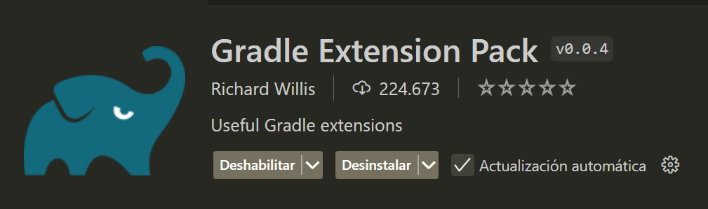

 ## Selenium

Is an open source **test automation** tool designed for testing web applications. It allows testers and developers to create scripts to automate user interactions in browsers such as Chrome, Firefox, Safari, and Edge, simulating actions such as clicks, text input, and navigation between pages.

 ### Selenium's main components
-  **Selenium WebDriver**: It is a **library** that allows you to write scripts in several programming languages (such as Java, Python, C#, and JavaScript) and control the browser directly. It is ideal for functional and user interface testing in web applications.
    
-  **Selenium IDE**: A **record and playback** testing  tool that allows users to create scripts without writing code. It is useful for creating quick scripts, but with limited functionality.
    
-  **Selenium Grid**: Allows tests to be run on multiple browsers and operating systems simultaneously. It is useful for compatibility testing in different environments and speeding up test execution time.


 ### Automated testing with Selenium Web Driver
Automating repetitive tasks and ensuring that a web application works correctly after every code change saves time, detects errors faster, and ensures application stability across multiple browsers and devices. 

 #### Tests
-  **Functional Tests:** 
These tests verify that the application's functionalities behave as expected. For example, making sure that a login form allows correct access to the system.
-  **Regression Tests:** 
Regression tests are those that are performed every time a change is made to the code to ensure that existing functionality is not affected. Selenium is ideal for this type of testing as it automates the verification process for each release.
-  **Integration Testing**
Integration tests verify that the modules of an application work together. For example, that the login, navigation and dashboard access are correctly integrated into the system.
- **Browser Compatibility Testing:**
Selenium allows you to run tests in different browsers (Chrome, Firefox, Edge, Safari), which is essential to ensure that the application works correctly in all environments.


## Gradle
Tool for managing the building, testing, packaging and deployment of applications. 

### How Gradle Works
-  **Build Scripts (`build.gradle`)**: Gradle projects are configured through script files called `build.gradle` (for Groovy) or `build.gradle.kts` (for Kotlin). In these files, tasks such as compiling, testing, packaging or running the application are defined.
-  **Tasks**: Gradle organizes the build process into `tasks`, which are individual actions, such as compiling the code or running tests. You can execute specific tasks (e.g. `gradle build`, `gradle test`) or group them into workflows.
-  **Dependencies**: In the configuration file, you can specify external dependencies that Gradle will automatically download. This allows you to manage library versions and facilitates the maintenance of dependencies in the project.


### Using Gradle with Selenium WebDriver offers these key advantages:

- **Dependency Management:** Automatically handles Selenium and other libraries, ensuring consistency.
- **Automation:** Streamlines tasks like compiling and running tests.
Parallel Execution: Runs tests faster across multiple browsers/environments.
- **CI/CD** Integration: Works seamlessly with Jenkins, GitLab, and others for automated testing.
- **Incremental Builds:** Only re-tests modified components, saving time.
- **Customizability:** Easily tailored for specific testing needs.
- **Detailed Reports:** Provides clear test results and performance insights.
Gradle makes Selenium testing frameworks efficient, flexible, and CI-ready.

 ### Advantages and Disadvantages of Selenium WebDriver
**Advantages:**
- Flexibility: Supports multiple languages and browsers.
- Fast Automation: Allows to run many tests in parallel and in less time.
- Integration: Compatible with CI/CD tools such as Jenkins to integrate tests into the development flow.
**Disadvantages**
- Limitation to Web Applications: Selenium can only automate applications in web browsers, not desktop applications.
- Maintenance: Tests can break if the user interface changes, requiring constant maintenance of scripts.
- Learning Curve: Requires programming knowledge and understanding of web architecture.


Selenium offers seven **types of locators** for interacting with web applications, essential for performing actions such as clicks, swipes and text inputs in automated tests. These locators are divided into simple and advanced:

-  **Simple Locators:** 
*By.id () :* Locate an element  by “id” attribute.
*By.id():* Locates an element by the “id” attribute.
*By.name():* Locate by “name” attribute.
*By.tagName():* Locate by the tag name (e.g. input).
*By.className():* Locate by a CSS class of the element.
*By.linkText()* and *By.partialLinkText():* Locate links by their exact or partial text.

-  **Advanced Locators:** 
*By.cssSelector()* and *By. cssSelector( )*.
*By.cssSelector():* Locate elements using CSS selectors.
*By.xPath():* Locate elements using XPath expressions.

- **Relative Locators:**
Useful when elements are difficult to identify, they allow you to locate elements relative to each other. Examples:
*RelativeLocator.with(By.tagName()).above(By.id()):* Locates one element above another.
*RelativeLocator.with(By.tagName()).below(By.id()):* Locates one element below another.
*RelativeLocator.with(By.tagName()).toLeftOf(By.id()):* Locates an element to the left of another.
*RelativeLocator.with(By.tagName()).toRightOf(By.id()):* Locates one element to the right of another.
These locators make Selenium versatile and accurate for testing complex interfaces.

## Selenium WebDriver Practical Session

## Installations
Download and configure the JDK (**Windows**):

 - **Download JDK:**
        - Go to the official Oracle website ([oracle.com](https://www.oracle.com/java/technologies/downloads/)) and download the JDK installer appropriate for your version of Windows (32-bit or 64-bit).
        
- **Run the Installer:** 
        - Open the downloaded file and follow the installer instructions. During the installation, you can change the installation path or leave it as default.
        
-  **Configure the PATH (Optional):** 
        - To be able to run Java from anywhere on the command line, you must add the JDK path to your system's PATH.
        - Look for “Environment Variables” in the system configuration and add the path to the JDK bin directory (e.g., C:\Program Files\Java\jdk-11\bin) to the PATH variable.


 2. Gradle
    - **Download the installer**: Go to the official website of [gradle.org](https://gradle.org/install/) download and run the installer.
    - **Extract the ZIP File**: Unzip the downloaded ZIP file to a folder on your system, for example, `C:Gradle`, the unzipped folder should contain subfolders such as `bin` and `lib`.
    - **Set the environment variable**: 
    - Open the **Start** menu, type `environment variables`, and select **Edit System Environment Variables**.
    - In the System Properties window, click **Environment Variables**.
    - Under **System Variables**, find the `Path` variable and click **Edit**.
    - Click **New** and enter the path to the Gradle `bin` folder, for example: `C:Gradle Gradle-<version>bin`.
    - Click **OK** in all windows to save the changes.

Verify the installation:
3. Go to your command window and type:


```
java -version

gradle -v
```

Deberías obtener una respuesta así: 


4. Extensions:
- Open Visual Studio Code and install the following extensions:


    

    

  

 
## First project

1. Open VSC and in the command palette type Java > Select Gradle: Create a Gradle Java Project > Select the folder of your choice where the project will be created > Select Groovy > Name the project > Enter. 


2. Organize your project:
- Take out the src folder of app.
- Delete the App.java and AppTest.java files.
- Verify that your project has a build.gradle file, if not, create it and insert the following configurations:

```build.gradle
plugins {
    id 'java'
}

group = 'com.example'
version = '1.0-SNAPSHOT'

repositories {
    mavenCentral()
}

dependencies {
    // Selenium WebDriver
    implementation 'org.seleniumhq.selenium:selenium-java:4.25.0'

    // WebDriverManager para la administración automática del driver
    implementation 'io.github.bonigarcia:webdrivermanager:5.9.2'

    // TestNG para pruebas
    testImplementation 'org.testng:testng:7.7.1'
}

test {
    useTestNG()
}


```
[Maven](https://mvnrepository.com/)
  
- From your terminal run 

```
gradle build
```

```
gradle clean
```

or from the gradle extension:


 3.  Create the main file of your project in this case CoffeTech.java in the pages folder with this code: 

```java

package coffeetech;

import org.openqa.selenium.WebDriver;
import org.openqa.selenium.chrome.ChromeDriver;
import org.testng.annotations.AfterMethod;
import org.testng.annotations.BeforeMethod;
import org.testng.annotations.Test;
import io.github.bonigarcia.wdm.WebDriverManager;

public class CoffeeTechTest {

    private WebDriver driver;

    @BeforeMethod
    public void setUp() {
        // Inicializa el WebDriver para Chrome
        WebDriverManager.chromedriver().setup();
        driver = new ChromeDriver();
        driver.manage().window().maximize();
    }

    @Test
    public void navigateToCoffeeTechPage() throws InterruptedException {
        // Navega a la página web
        driver.get("https://coffeetech.netlify.app");

        // Pausa de 5 segundos para ver la página
        Thread.sleep(5000);

        // Verifica el título de la página
        String title = driver.getTitle();
        System.out.println("El título de la página es: " + title);
    }

    @AfterMethod
    public void tearDown() {
        // Cierra el navegador después de la prueba
        if (driver != null) {
            driver.quit();
        }
    }
}

```
 
Run the test by clicking on the green button next to test, you will see a Chrome window open on our test page https://coffeetech.netlify.app. In the terminal you will see the test results showing a check icon when the test is successful. 


